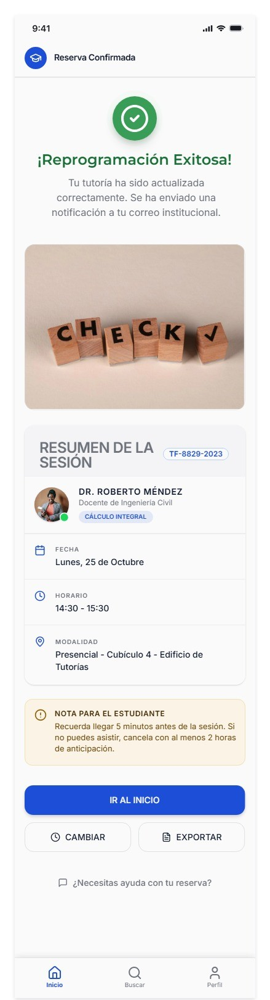
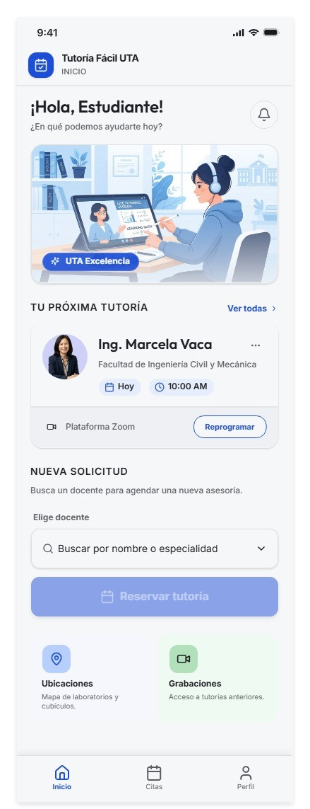
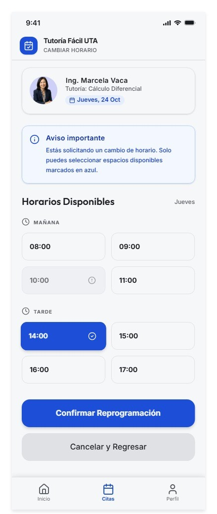
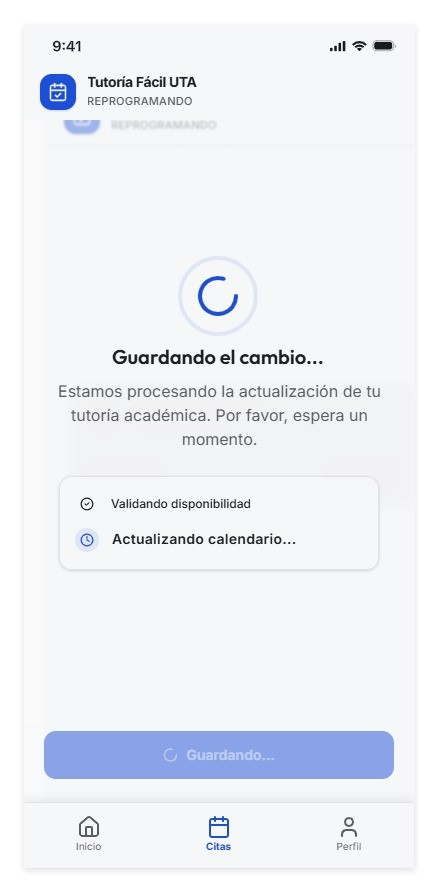
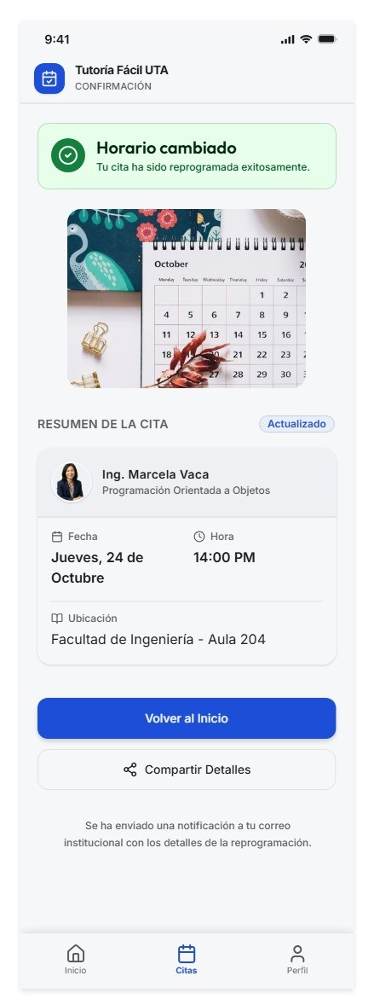

# Prototipo Tutoría Fácil UTA

- **Herramienta:** Visily
- **Enlace del prototipo navegable:** https://app.visily.ai/projects/3cf48af8-7134-45cb-b7d1-483cb7673fbe/boards/2730954/presenter?play-mode=All+screens
- **Enlace del archivo de diseño:** [Ver PDF](frames_prototipo.pdf)

- **Responsable:** Sebastian Santana (@SebasIsd) · Issue #3

## Recorrido del flujo principal
1. Inicio: el estudiante elige docente y pulsa "Reservar tutoría".
2. Docente y horario: elige el jueves y un horario disponible (los ocupados no son seleccionables).
3. Resumen: revisa los datos y pulsa "Confirmar tutoría".
4. Confirmada: ve el estado inequívoco y puede pulsar "Cambiar horario".

## Decisiones visibles
- Prevención de errores: los horarios ocupados no son accionables (E3).
- Corrección antes de confirmar: "Volver y cambiar horario" (E10).
- Retroalimentación: estados de carga, error y confirmación con texto (E3, E5, E8).
- Accesibilidad: estados con texto y no solo color; foco visible; nombres accesibles (E2, E9).

## Capturas

---
# Cambios realizados por los Requsitos de Usuario
- **Herramienta:** Visily
- **Enlace del prototipo navegable:** https://app.visily.ai/projects/a97294e6-8e73-4edd-b6f6-c3235bb2de9c/boards/2730988/presenter?play-mode=All+screens
- **Enlace del archivo de diseño:** [Ver PDF](mejora_prototipo.pdf)

## Revisión requisito por requisito

| Req. | Qué pide | ¿Lo cubre mi diseño? | Qué hacer |
|---|---|---|---|
| **R1** | Consultar disponibilidad por fecha y reservar en pocos pasos desde el teléfono | Sí. La pantalla 1 lleva a la 2 con la fila de días y la lista de horarios. | Nada. Cuenta los toques del recorrido y confirma que son **≤ 8**. |
| **R2** | Distinguir disponible, ocupado y seleccionado con texto, no solo color, y usable con teclado y zoom | Sí, con las 3 variantes del componente "Horario" y la variante de foco. | Nada, salvo comprobar que el texto sigue legible con zoom 200 % en la pantalla 2. |
| **R3** | Revisar resumen y volver a corregir antes de confirmar | Sí, con la tarjeta y el botón "Volver y cambiar horario". | Nada. |
| **R4** | Confirmación inequívoca **en un lugar propio y fácil de encontrar**, con "Mis tutorías" en la pantalla 1 | **Parcial.** Mi botón "Mis tutorías" llevaba directo a la pantalla 4, y la pantalla 1 no mostraba la cita guardada. | **Ajuste A** |
| **R5** | Reprogramar desde la propia cita, con **mensajes de estado si la respuesta tarda**, y volver a la pantalla 2 | **Parcial.** El estado de carga solo estaba al confirmar la reserva, no al confirmar el cambio de horario. | **Ajuste B** |

## Tabla de conexiones actualizada

| Desde | Elemento | Hacia |
|---|---|---|
| 1 | Reservar tutoría | 2 |
| 1 | Mis tutorías | Aviso "Aún no tienes tutorías" |
| 2 | Horario disponible | Estado "Seleccionado" |
| 2 | Continuar | 3 |
| 3 | Confirmar tutoría | 3-Cargando → 4 |
| 3 | Volver y cambiar horario | 2 |
| 4 | Cambiar horario | 2-Reprogramar |
| 4 | Ir al inicio | 1_Inicio_con_cita |
| 1_Inicio_con_cita | Tarjeta / Mis tutorías | 4 |
| 2-Reprogramar | Guardar nuevo horario | 3_Reprogramar_cargando → 4 actualizada |

## Capturas

