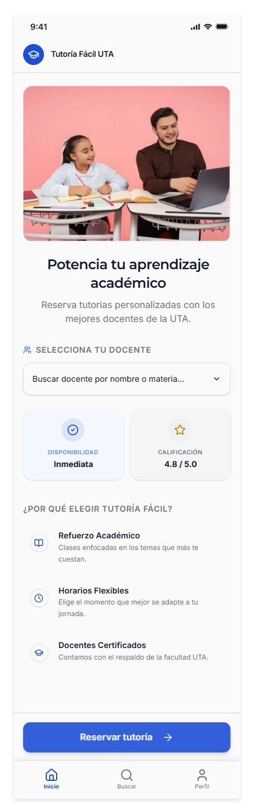
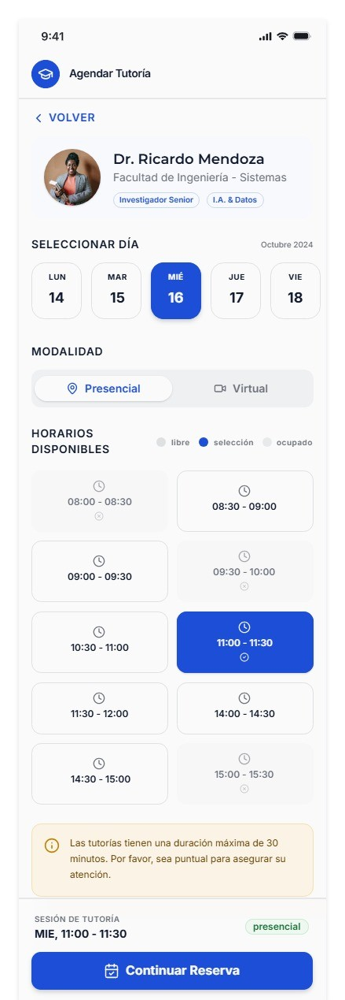
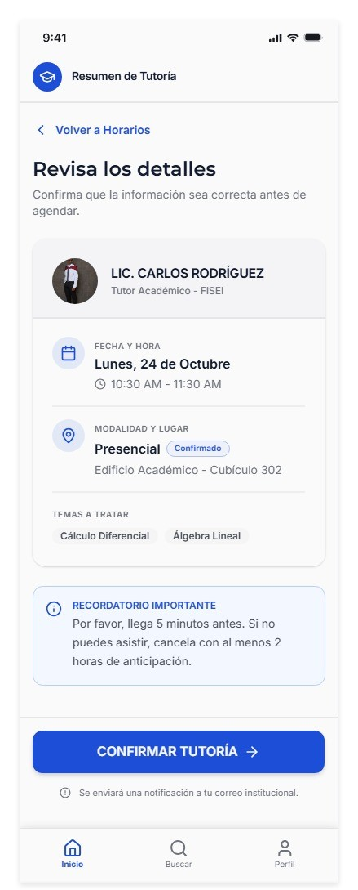

# Prototipo Tutoría Fácil UTA

- **Herramienta:** Figma Design
- **Enlace del prototipo navegable:** https://app.visily.ai/projects/3cf48af8-7134-45cb-b7d1-483cb7673fbe/boards/2730954/presenter?play-mode=All+screens
- **Enlace del archivo de diseño:** [Ver PDF](frames_prototipo.pdf)

- **Responsable:** Sebastian Santana (@SebasIsd) · Issue #3

## Recorrido del flujo principal
1. Inicio: el estudiante elige docente y pulsa "Reservar tutoría".
2. Docente y horario: elige el jueves y un horario disponible (los ocupados no son seleccionables).
3. Resumen: revisa los datos y pulsa "Confirmar tutoría".
4. Confirmada: ve el estado inequívoco y puede pulsar "Cambiar horario".

## Decisiones visibles
- Prevención de errores: los horarios ocupados no son accionables (E3).
- Corrección antes de confirmar: "Volver y cambiar horario" (E10).
- Retroalimentación: estados de carga, error y confirmación con texto (E3, E5, E8).
- Accesibilidad: estados con texto y no solo color; foco visible; nombres accesibles (E2, E9).

## Capturas

