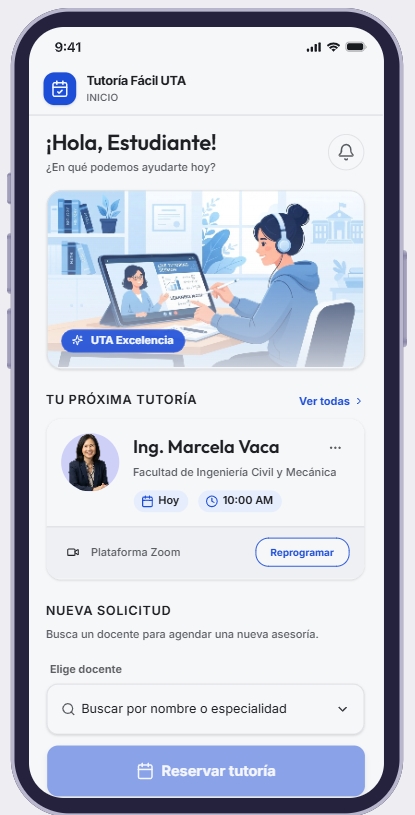
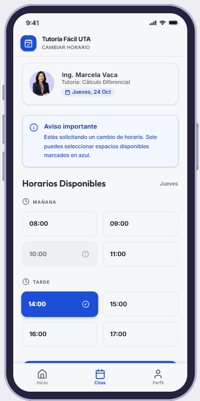
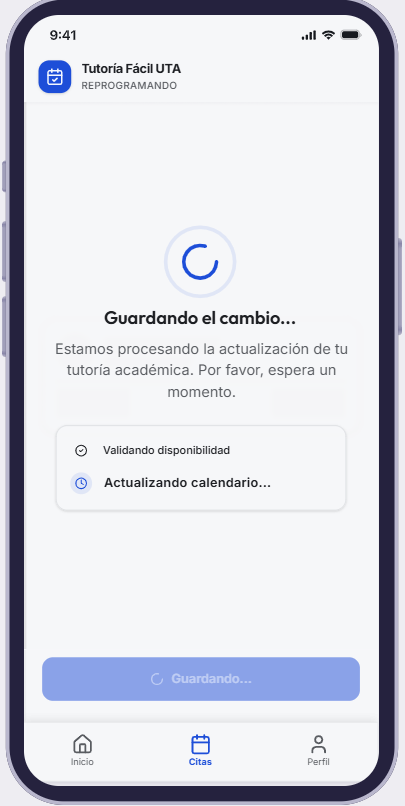
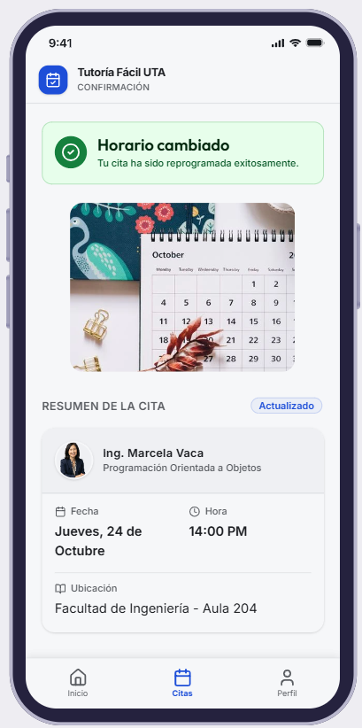

# Prototipo · Tutoría Fácil UTA

| Dato                                            | Valor                                                                                                                                           |
| ----------------------------------------------- | ----------------------------------------------------------------------------------------------------------------------------------------------- |
| Herramienta                                     | `Visily`                                                                                                                                        |
| Enlace navegable (modo Prototype, solo lectura) | [Abrir prototipo en Visily](https://app.visily.ai/projects/a97294e6-8e73-4edd-b6f6-c3235bb2de9c/boards/2730988/presenter?play-mode=All+screens) |
| Permisos                                        | Cualquier persona con el enlace puede ver                                                                                                       |

## Pantallas

| N.° | Pantalla                    | Captura                                             |
| --- | --------------------------- | --------------------------------------------------- |
| 1   | Inicio y búsqueda           | Inicio y búsqueda         |
| 2   | Docente y horario           | Docente y horario          |
| 3   | Resumen y confirmación      | Resumen y confirmación     |
| 4   | Confirmada y reprogramación | Confirmada y reprogramación |

### 1. Inicio y búsqueda

### 2. Docente y horario

### 3. Resumen y confirmación

### 4. Confirmada y reprogramación

